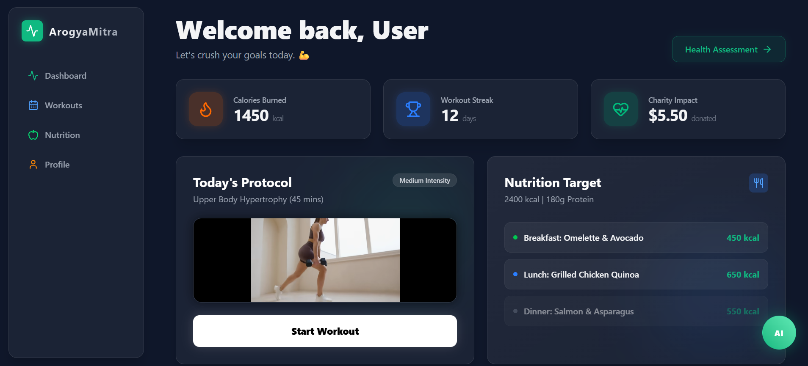
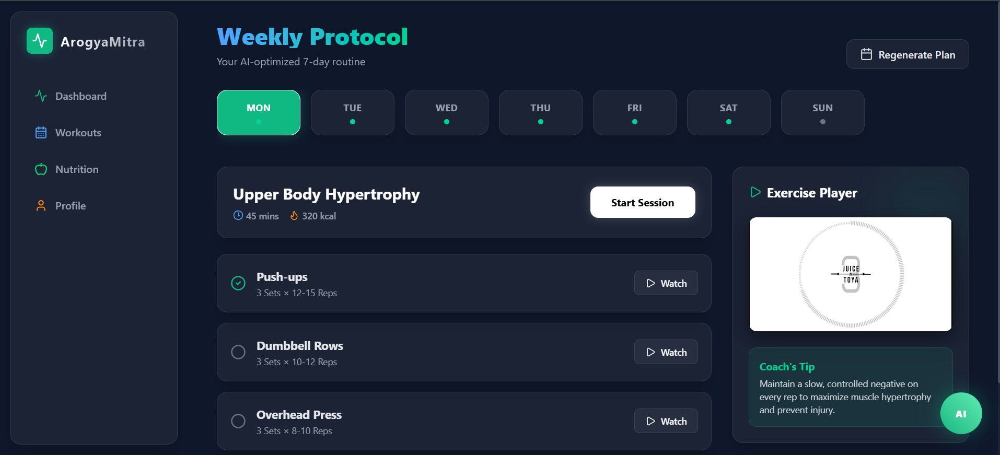
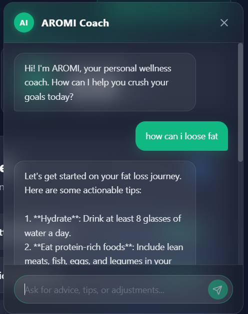
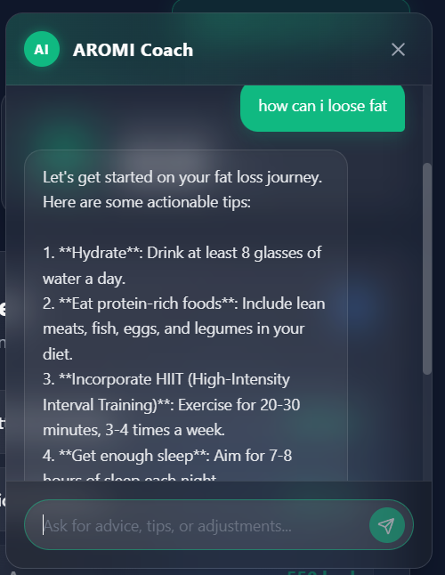
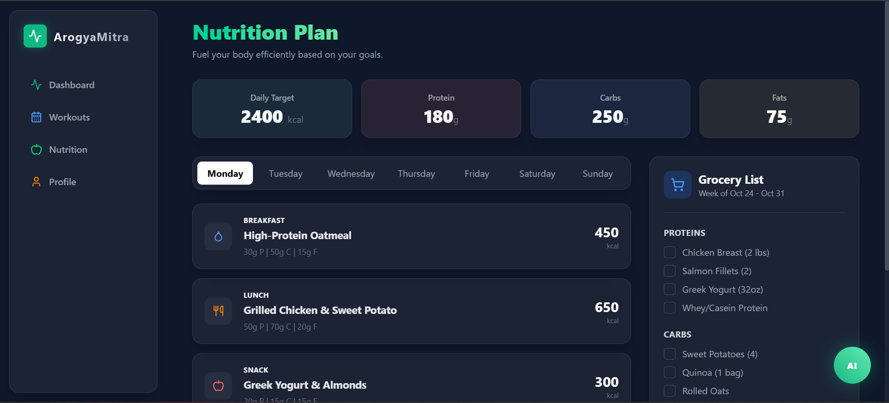
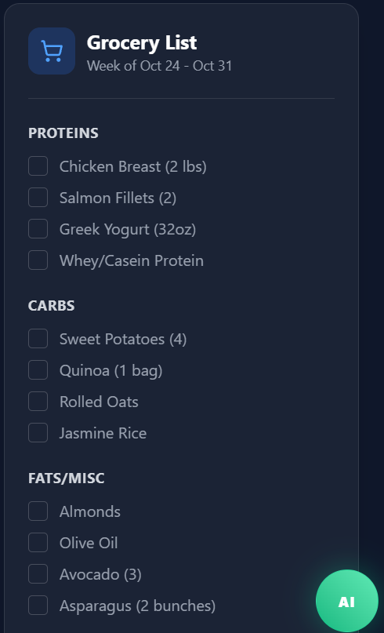
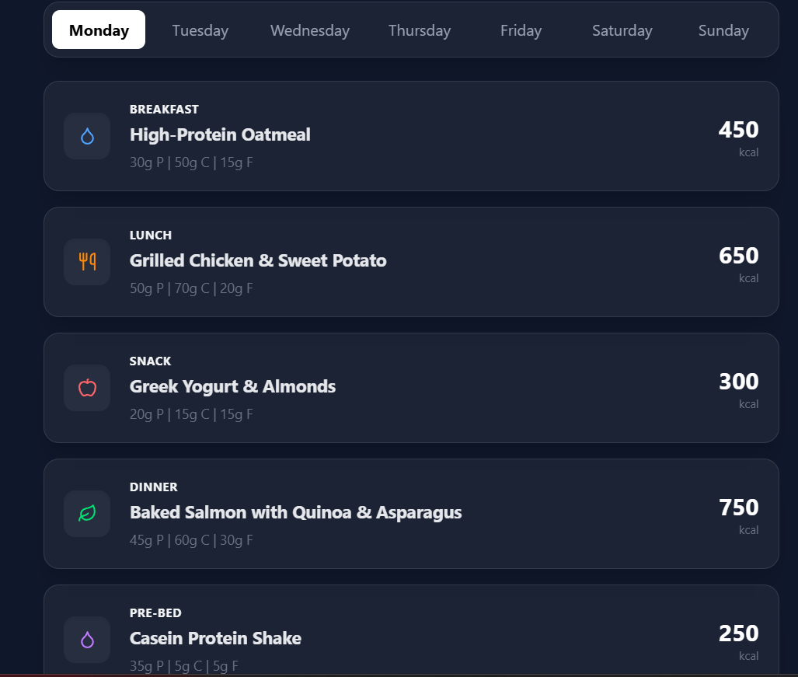
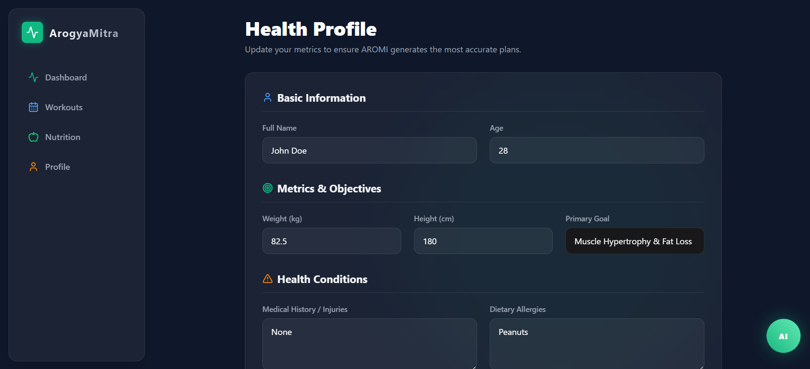

# 🏥 ArogyaMitra — AI-Powered Fitness & Wellness Platform

<div align="center">

**Your personal AI wellness companion for fitness, nutrition, and health tracking.**


</div>

---

## 📖 Overview

**ArogyaMitra** (meaning *Health Friend* in Sanskrit) is a full-stack AI-powered fitness and wellness web application. It combines personalized workout planning, intelligent nutrition tracking, and an AI coaching assistant — all in one sleek, dark-themed dashboard. Built to help users crush their goals through smart, data-driven recommendations.

---

## 🎬 Demo Video

> 📽️ *Add your implementation video link here — e.g., YouTube, Loom, or a direct MP4 link*

[](YOUR_VIDEO_LINK_HERE)

---

## 📸 Screenshots

### 🏠 Dashboard


The main dashboard provides an at-a-glance overview of your fitness journey — calories burned, workout streak, charity impact, today's workout protocol, and nutrition targets.

### 🏋️ Weekly Workout Protocol


An AI-optimized 7-day workout plan with day-by-day exercise breakdowns, set/rep counts, an integrated Exercise Player, and real-time Coach's Tips.

### 🤖 AROMI AI Coach



Chat with **AROMI**, your personal AI wellness coach. Ask for fitness tips, fat loss strategies, meal adjustments, or anything health-related.

### 🥗 Nutrition Plan


A complete weekly meal plan with detailed macro breakdowns (Protein / Carbs / Fats), calorie counts per meal, and a smart Grocery List generator.

### 🛒 Grocery List


Auto-generated, categorized grocery list (Proteins / Carbs / Fats & Misc) synced to your weekly nutrition plan with interactive checkboxes.

### 📋 Meal Schedule


Day-by-day meal schedule covering Breakfast, Lunch, Snack, Dinner, and Pre-Bed meals — each with full macro detail.

### 👤 Health Profile


Personalized health profile form with basic info, metrics, fitness objectives, medical history, and dietary allergies — all used to power AROMI's AI recommendations.

---

## ✨ Features

| Feature | Description |
|---|---|
| 🏠 **Smart Dashboard** | Real-time stats: calories burned, workout streak, charity impact |
| 🏋️ **AI Workout Plans** | 7-day AI-optimized weekly protocols with exercise videos |
| 🥗 **Nutrition Tracking** | Full macro tracking with weekly meal plans & grocery lists |
| 🤖 **AROMI AI Coach** | Conversational AI assistant for personalized health guidance |
| 👤 **Health Profile** | Custom profile with goals, medical history & dietary preferences |
| 🛒 **Grocery Generator** | Auto-generates shopping lists from your weekly meal plan |
| 🎯 **Goal Tracking** | Visual progress tracking toward fitness and health goals |
| 💚 **Charity Impact** | Tracks charitable donations linked to fitness milestones |

---

## 🛠️ Tech Stack

### Frontend


### Backend / AI


### Database


---


### Installation

```bash
# 1. Clone the repository
git clone https://github.com/ShrikarBende/ArogyaMitra.git
cd ArogyaMitra

# 2. Install dependencies
npm install

# 3. Set up environment variables
cp .env.example .env
```

Edit your `.env` file:

```env
GROQ_API_KEY=""
YOUTUBE_API_KEY=""
SPOONACULAR_KEY=""
GOOGLE_CALENDAR_CLIENT_ID=""
GOOGLE_CALENDAR_CLIENT_SECRET=""
DATABASE_URL=""
SECRET_KEY=""
```

```bash
# 4. Start the development server
npm run dev
```

Open [http://localhost:3000](http://localhost:3000) in your browser.

---


## 🤖 AROMI — AI Wellness Coach

AROMI (AI-powered Responsive Online Medical Intelligence) is the heart of ArogyaMitra. It uses the OpenAI API to:

- Answer fitness and nutrition questions
- Suggest workout modifications based on your profile
- Provide actionable fat loss, muscle gain, and wellness tips
- Adjust meal plans based on dietary restrictions and goals

Simply click the **AI** button in the bottom-right corner from any page to start chatting.

---

## 🗺️ Roadmap

- [ ] Wearable device integration (Apple Watch, Fitbit)
- [ ] Progress photo uploads with AI body composition analysis
- [ ] Social challenges & leaderboards
- [ ] Recipe generator with custom macro targets
- [ ] Push notifications for workout reminders
- [ ] Export workout/nutrition reports as PDF

---


Please follow the existing code style and include relevant tests where applicable.

---


<div align="center">

Made with ❤️ for better health & wellness

⭐ **Star this repo** if you found it helpful!

</div>
